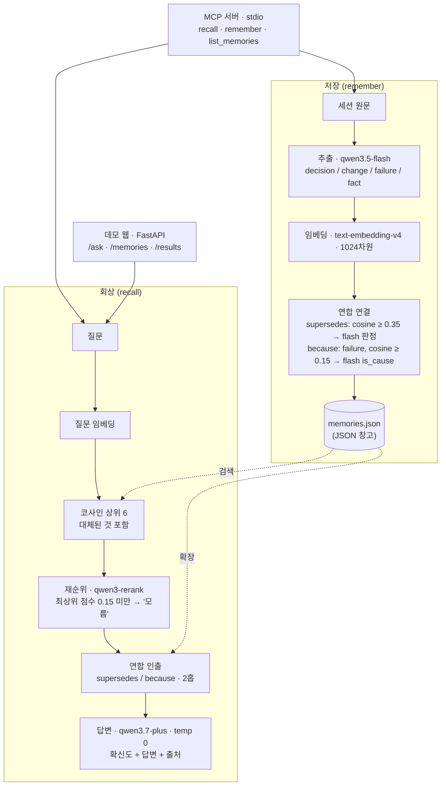

# Mnemosure

[English](README.md) | **한국어**

> 모르면 모른다고 하고, 아는 건 출처와 함께 말하는 AI 메모리 레이어.
> Qwen Cloud Global AI Hackathon · **Track 1 (MemoryAgent)**

여러 세션에 걸친 AI 협업에서는 두 가지 실패가 겹친다. 내렸던 결정을 **잊어버리고**, 내린 적 없는 결정을 **지어낸다**. Mnemosure는 이 둘을 동시에 공략하는 출처 기반 메모리 레이어다.

핵심 주장: **기억하지 못하는 것을 지어내지 않고, 기억한 것은 빠뜨리지 않는다.**

---

## 무엇을 하나

- 대화에서 오래 남을 것 — 결정·변경·실패·확정된 사실 — 만 **저장**하고 잡담은 버린다.
- 시간에 따라 기억을 **연결**한다. 새 결정이 옛 결정을 갈아엎으면 옛것을 `superseded`(대체됨)로 표시하고, 어떤 변경의 *이유*를 그 원인이 된 실패(`because`)에 이어둔다.
- 확신도와 출처를 붙여 **회상**한다. 증거가 옛 기억을 대체하면 옛 사실을 되풀이하지 않고 *바로잡는다*. 증거가 없으면 지어내지 않고 *"기록에 없다"* 고 답한다.

모든 답은 세 확신도 — **확실 / 어렴풋 / 모름** — 중 하나로, 인용한 각 기억의 출처와 함께 돌아온다.

## 아키텍처



**저장** (`mnemosure/memory/store.py`): 세션을 `qwen3.5-flash`에 넘겨 나중에 중요해질 것만 추출한다. 각 기억을 임베딩한 뒤 두 종류의 연합을 잇는데, 어휘 유사도(코사인) 1차 거름망이 후보를 제안하고 최종 판단은 flash 모델이 한다 — 표면 유사도만으로 연결하지 않는다. 실패·교훈은 절대 대체되지 않는다(영구 보존).

**회상** (`mnemosure/memory/recall.py`): 질문을 임베딩해 상위 후보를 모으는데, *대체된 것까지 포함*한다. 낡은 믿음을 바로잡으려면 먼저 그것을 찾아야 하기 때문이다. `qwen3-rerank`가 관련도로 재정렬하고, 최상위조차 너무 약하면 지어내는 대신 **모름**으로 답한다. 살아남은 씨앗을 `supersedes`/`because` 링크를 따라 2홉 펼치고, `qwen3.7-plus`가 **그 증거에만 근거해** 최종 답을 구성한다(temperature 0). "전체 요약" 같은 넓은 질문은 상위 K개를 건너뛰고 활성 기억 전체를 근거로 삼아 누락을 막는다.

## 사용 모델 (Qwen Cloud / DashScope)

| 역할 | 모델 | 엔드포인트 |
|---|---|---|
| 두뇌(메인 답변) | `qwen3.7-plus-2026-05-26` | OpenAI 호환 `/compatible-mode/v1` |
| 두뇌(추출·채점·분류) | `qwen3.5-flash` | OpenAI 호환 `/compatible-mode/v1` |
| 색인(임베딩, 1024차원) | `text-embedding-v4` | OpenAI 호환 `/compatible-mode/v1` |
| 정밀 재순위 | `qwen3-rerank` | 네이티브 `/api/v1/services/rerank/...` |

API 키는 **환경변수(또는 `.env`)에서만** 읽으며 코드에 하드코딩하지 않는다. 모델 ID는 위 값이 기본이고, 쿼터 소진 시 `MNEMOSURE_MODEL_*` 환경변수로 실행별 오버라이드할 수 있다 — 자동 전환은 하지 않는다. 기본값은 `mnemosure/config.py`(단일 출처)에 있다.

## 설치

```bash
pip install mnemosure          # 코어 라이브러리 + MCP 서버
pip install "mnemosure[demo]"  # 데모 웹 서버용 FastAPI/uvicorn 까지 함께
```

Qwen Cloud 키를 넣고(`export DASHSCOPE_API_KEY=...`) MCP 서버를 실행한다:

```bash
mnemosure-mcp                  # stdio MCP 서버
```

- **실행에는 Qwen 키가 필요하다** — Mnemosure는 Qwen 클라이언트다(추출·임베딩·재순위·답변을 모두 Qwen이 함). 키가 없으면 도구가 명확한 오류를 낸다.
- **기억 저장 위치:** 설치본은 `~/.mnemosure/memories.json`의 *빈 창고*로 시작한다. 폴더는 `MNEMOSURE_DATA_DIR`로 바꿀 수 있다. (미리 채운 NXTBot 데모 스냅샷은 pip 패키지가 아니라 이 저장소에 있다 — 데모를 보려면 레포를 클론한다.)

## 빠른 시작 (소스에서)

```bash
# 1) 프로젝트 전용 가상환경 생성·활성화
python3 -m venv .venv
source .venv/bin/activate

# 2) 의존성 설치
pip install -r requirements.txt

# 3) Qwen Cloud(DashScope) 키 준비
cp .env.example .env        # .env 를 열어 DASHSCOPE_API_KEY 를 채운다

# 4) 네 모델이 모두 살아있는지 확인
python scripts/check_models.py
```

## 데모 실행

레포에는 **사전계산된 데모 스냅샷**(`data/scenarios/<key>/` 아래)이 함께 들어 있어 클론 직후 바로 동작한다:

```bash
python scripts/run_demo.py      # → http://127.0.0.1:8000
```

**두 시나리오**(장전 자동매매 봇 · SaaS 구독 요금제 개편)를 전환할 수 있고, 각 시나리오의 **원본 대화**를 펼쳐 기억이 하드코딩이 아니라 여러 세션 대화에서 *추출된 것*임을 확인할 수 있다. 기억 창고와 before/after 평가 패널은 스냅샷에서 바로 렌더되므로 **키 없이도** 둘러볼 수 있다. `/ask`(라이브 근거 회상)만 Qwen을 호출하므로 키가 필요하다. 특정 시나리오 스냅샷을 다시 만들려면(쿼터 소모):

```bash
python scripts/gen_demo_data.py            # 모든 시나리오(미계산분만)
python scripts/gen_demo_data.py uiux       # 특정 시나리오만
```

## MCP 서버로 사용하기

Mnemosure는 메모리 레이어를 **Model Context Protocol**로 노출한다. 그래서 MCP를 지원하는 에이전트(Claude Desktop, Claude Code 등)라면 이걸 도구처럼 호출할 수 있다.

```bash
mnemosure-mcp                       # pip 설치했다면
python -m mnemosure.mcp_server      # 소스 체크아웃에서도 동일
```

에이전트의 `.mcp.json`(또는 동급 설정)에 등록한다. `pip install mnemosure` 후에는 콘솔 명령 하나면 된다:

```json
{
  "mcpServers": {
    "mnemosure": {
      "command": "mnemosure-mcp",
      "env": { "DASHSCOPE_API_KEY": "발급받은_키" }
    }
  }
}
```

> 설치 대신 소스 체크아웃에서 돌린다면: `"command": "/절대경로/.venv/bin/python"`, `"args": ["-m", "mnemosure.mcp_server"]`, 그리고 작업 디렉터리와 무관하게 임포트되도록 `"PYTHONPATH": "/절대경로/레포"` 를 추가한다.

도구:

| 도구 | 시그니처 | 반환 |
|---|---|---|
| `recall` | `recall(query: str)` | `{confidence, answer, cited}` — 출처(기억 id) 인용이 붙은 근거 기반 답 |
| `remember` | `remember(session_text: str, date="", title="")` | `{stored: [...], count}` — 결정·변경·실패 추출 + supersedes/because 자동 연결 |
| `list_memories` | `list_memories(include_superseded=False)` | 유효(또는 전체) 기억 목록(출처 포함) |

> 참고: 서버 자체가 분류·회상·근거화를 위해 Qwen을 호출한다 — 에이전트에 종속되지 않지만 **Qwen 키가 있다고 전제**한다(환경변수 또는 `.env`).

## 평가 방식

품질은 하나의 불투명한 점수가 아니라, 각 답변의 **행동**을 라벨링해 측정한다 — 정확 / 누락 / 환각 / 잡음 / 정직 — 그리고 우리만의 세 단계 **확신도**(확실 / 어렴풋 / 모름)를 함께 본다. 파이프라인 전체(추출·대체판정·채점)는 재현성을 위해 **temperature 0** 으로 돈다. 데모는 스냅샷을 고정 서빙해 매번 같은 결과가 나온다.

`mnemosure/evaluation/`(`harness.py`, `judge.py`, `label.py`, `baseline.py`, `answer_key.py`) 참고.

## 폴더 구조

```
mnemosure/
  config.py           # 모델·엔드포인트·키 로딩 — 단일 출처
  qwen_client.py      # Qwen으로 가는 유일한 통로 (chat / embed / rerank)
  mcp_server.py       # MCP 도구: recall · remember · list_memories (stdio)
  memory/
    store.py          # 저장: 추출 → 임베딩 → supersedes/because 연결 → 저장
    recall.py         # 회상: 임베딩 → 재순위 → 연합 인출 → 근거 기반 답변
    forget.py         # 망각 / 관련성 분별
    storage.py        # JSON 파일 기억 창고
    models.py         # Memory / Association / Source 데이터클래스
  evaluation/         # harness · judge · label · baseline · answer_key
  demo/
    server.py         # FastAPI: /ask · /memories · /results · /sessions · /scenarios
    index.html        # 단일 페이지 데모 UI (시나리오 전환 + 원본 대화 보기)
    scenarios.py      # 시나리오 레지스트리 (세션 + 정답셋 + 스냅샷 경로)
    sample_sessions.py# 데모·평가용 가상 시나리오 (자동매매 봇, 구독 요금제 개편)
scripts/              # check_models · gen_demo_data · run_demo · demo_* 보조
data/scenarios/<key>/ # 시나리오별 memories.json + results.json (데모 스냅샷, 커밋됨)
```

## 배포

Alibaba Cloud 배포 가이드(컨테이너화)는 다음 커밋에서 추가한다.

## 라이선스

[MIT](LICENSE).
