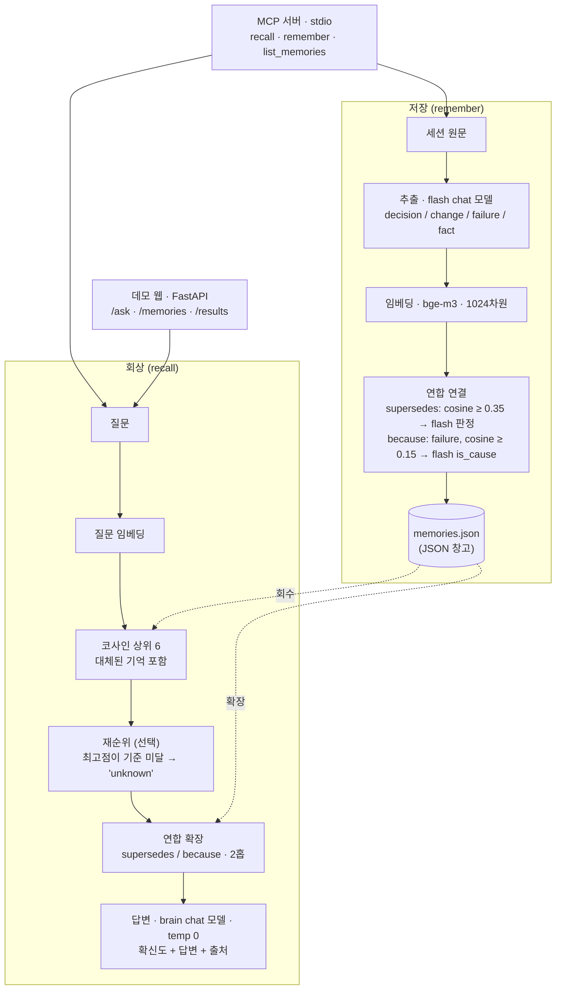

# Mnemosure

[English](README.md) | **한국어**

> 모르면 모른다고 하고, 아는 건 출처와 함께 말하는 AI 메모리 레이어.

여러 세션에 걸친 AI 협업에서는 두 가지 실패가 겹친다. 내렸던 결정을 **잊어버리고**, 내린 적 없는 결정을 **지어낸다**. Mnemosure는 이 둘을 동시에 공략하는 출처 기반 메모리 레이어다.

핵심 주장: **기억하지 못하는 것을 지어내지 않고, 기억한 것은 빠뜨리지 않는다.**

API 키 하나([OpenRouter](https://openrouter.ai))로 파이프라인 전체가 돈다 — chat·임베딩·rerank 모델을 원하는 대로 고르고(Claude, GPT, Qwen, …), 임베딩은 키 없이 로컬로 돌릴 수도 있다.

---

## 무엇을 하나

- 대화에서 오래 남을 것 — 결정·변경·실패·확정된 사실 — 만 **저장**하고 잡담은 버린다.
- 시간에 따라 기억을 **연결**한다. 새 결정이 옛 결정을 갈아엎으면 옛것을 `superseded`(대체됨)로 표시하고, 어떤 변경의 *이유*를 그 원인이 된 실패(`because`)에 이어둔다.
- 확신도와 출처를 붙여 **회상**한다. 증거가 옛 기억을 대체하면 옛 사실을 되풀이하지 않고 *바로잡는다*. 증거가 없으면 지어내지 않고 *"기록에 없다"* 고 답한다.

모든 답은 세 확신도 — **certain / vague / unknown** — 중 하나로, 인용한 각 기억의 출처와 함께 돌아온다.

## 아키텍처



**저장** (`mnemosure/memory/store.py`): 세션을 flash chat 모델에 넘겨 '나중에 중요해질 것'만 추출한다. 각 기억을 임베딩한 뒤 두 종류의 연합을 긋는다 — 어휘 유사도(코사인) 1차 거름망이 후보를 제안하고 flash 모델이 최종 판정하므로, 표면 유사성만으로 잇지 않는다. 실패는 절대 대체되지 않는다(교훈은 영구 보존).

**회상** (`mnemosure/memory/recall.py`): 질문을 임베딩해 상위 후보를 모은다 — *대체된 기억도 포함해서*. 낡은 믿음을 바로잡으려면 먼저 찾아야 하기 때문이다. 재순위 모델이 관련도 순으로 다시 세우고, 최고점조차 기준에 못 미치면 지어내는 대신 **unknown**으로 답한다. 살아남은 씨앗을 `supersedes`/`because` 링크로 2홉 확장하고, brain 모델이 **그 증거에만 근거해**(temperature 0) 답을 구성한다. "전부 요약해줘"류 질문은 top-K를 건너뛰고 활성 기억 전체에 근거한다(누락 방지).

## 모델 (OpenRouter 경유 — 자유 교체)

모든 모델 호출은 하나의 OpenAI 호환 게이트웨이(기본: OpenRouter)를 거친다. 기본값:

| 역할 | 기본 모델 | 교체 env |
|---|---|---|
| Brain (답변 생성) | `qwen/qwen3.7-plus` | `MNEMOSURE_MODEL_BRAIN` |
| Flash (추출·연결 판정) | `qwen/qwen3.5-flash-02-23` | `MNEMOSURE_MODEL_FLASH` |
| 색인 (임베딩, 1024차원) | `baai/bge-m3` | `MNEMOSURE_MODEL_EMBED` |
| 정밀 재순위 | `cohere/rerank-4-fast` | `MNEMOSURE_MODEL_RERANK` |

어느 역할이든 OpenRouter의 아무 모델 id로 바꿀 수 있다(`anthropic/claude-sonnet-5`, `openai/gpt-…` 등). 스위치 두 개 더:

- `MNEMOSURE_RERANK=off` — 재순위 호출을 생략. 순위·정직 게이트는 1차 코사인 점수를 쓴다. 저렴하지만 정밀도는 다소 낮다.
- `MNEMOSURE_BASE_URL` — OpenRouter 대신 다른 OpenAI 호환 게이트웨이 사용(이때 키는 `MNEMOSURE_API_KEY`).

정직 게이트 임계값(`MNEMOSURE_RERANK_FLOOR`, `MNEMOSURE_COSINE_FLOOR`)의 기본값은 위 기본 모델 기준 보정값이다 — 재순위·임베딩 모델을 바꾸면 자기 데이터로 재확인을 권한다.

API 키는 **오직** 환경변수(또는 `.env`)에서만 읽고 절대 하드코딩하지 않는다. 기본값은 `mnemosure/config.py`(단일 출처)에 있다.

## 설치

```bash
pip install mnemosure          # 코어 제품: 메모리 라이브러리 + MCP 서버
```

[OpenRouter 키](https://openrouter.ai/keys)를 넣고 MCP 서버를 실행한다:

```bash
export OPENROUTER_API_KEY=sk-or-...
mnemosure-mcp                  # stdio MCP 서버
```

- **기억 저장 위치:** 설치본은 `~/.mnemosure/memories.json`의 *빈* 창고로 시작한다. `MNEMOSURE_DATA_DIR`로 폴더를 바꿀 수 있다.
- pip 패키지는 **제품만** 담는다(`config`, `llm`, `mcp_server`, `reembed`, `memory/`). 웹 데모·평가 하네스는 이 레포에 있다(클론해서 실행).

### 로컬 임베딩 (색인은 키 없이)

```bash
pip install "mnemosure[local]"
export MNEMOSURE_EMBED_PROVIDER=local
```

임베딩을 [fastembed](https://github.com/qdrant/fastembed)로 내 컴퓨터에서 계산한다(기본 모델: `intfloat/multilingual-e5-large`, 1024차원). 모델 가중치는 패키지에 **미포함** — 첫 사용 때 Hugging Face에서 한 번 내려받아 캐시한다(이후 오프라인 동작; 막힌 망에서는 fastembed 캐시 폴더에 수동 배치). chat·재순위는 여전히 API 키를 쓴다.

### 임베딩 모델 교체 (마이그레이션)

다른 임베딩 모델의 벡터는 섞이지 않는다 — 창고가 자신을 만든 모델을 기록하고 있어서, 불일치하면 조용히 망가지는 대신 실행을 거부하고 안내한다. 모델을 바꿀 때(api↔local 포함)는 한 번 재임베딩한다:

```bash
python -m mnemosure.reembed                      # 기본 창고
python -m mnemosure.reembed path/to/memories.json
```

## 빠른 시작 (소스에서)

```bash
# 1) 프로젝트 가상환경 생성·활성화
python3 -m venv .venv
source .venv/bin/activate

# 2) 의존성 설치
pip install -r requirements.txt

# 3) OpenRouter 키 설정
cp .env.example .env        # .env 를 열어 OPENROUTER_API_KEY 설정

# 4) 네 가지 모델 역할 연결 확인
python scripts/check_models.py
```

## 데모 실행

레포에 **사전계산 스냅샷**(`data/scenarios/<key>/`)이 포함돼 있어 클론 직후 바로 돈다:

```bash
python scripts/run_demo.py      # → http://127.0.0.1:8000
```

**두 시나리오** — 장전 자동매매 봇, SaaS 구독 요금제 개편 — 를 전환하며 볼 수 있다. 각 시나리오의 **원본 대화**도 펼쳐볼 수 있어, 기억이 하드코딩이 아니라 실제 멀티세션 대화에서 *추출*됐음을 확인할 수 있다. 기억 창고·전후 비교 패널은 스냅샷을 그대로 렌더하므로 **키 없이** 볼 수 있다. `/ask`(라이브 회상)만 모델을 호출하므로 키가 필요하다. 스냅샷을 처음부터 다시 만들려면(크레딧 소모):

```bash
python scripts/gen_demo_data.py            # 전체 시나리오(없는 것만)
python scripts/gen_demo_data.py pricing    # 특정 시나리오
```

## MCP 서버로 쓰기

Mnemosure는 **Model Context Protocol**로 메모리 레이어를 노출한다. MCP를 지원하는 에이전트(Claude Desktop, Claude Code, Codex, …)라면 도구로 호출할 수 있다.

```bash
mnemosure-mcp                       # pip 설치 시
python -m mnemosure.mcp_server      # 소스 체크아웃에서 동일
```

에이전트의 `.mcp.json`(또는 동급 설정)에 등록한다. `pip install mnemosure` 후에는 콘솔 명령이면 충분하다:

```json
{
  "mcpServers": {
    "mnemosure": {
      "command": "mnemosure-mcp",
      "env": { "OPENROUTER_API_KEY": "sk-or-..." }
    }
  }
}
```

위 `.mcp.json`은 어느 MCP 클라이언트에서나 동작한다. **Claude Code**라면 한 줄로 등록할 수 있다:

```bash
claude mcp add mnemosure --env OPENROUTER_API_KEY=sk-or-... -- mnemosure-mcp
```

**[uv](https://docs.astral.sh/uv/)로 무설치 실행** — `pip install` 없이 PyPI에서 바로 실행한다(콘솔 명령 `mnemosure-mcp`가 패키지 이름 `mnemosure`와 달라 `--from`이 필요):

```json
{
  "mcpServers": {
    "mnemosure": {
      "command": "uvx",
      "args": ["--from", "mnemosure", "mnemosure-mcp"],
      "env": { "OPENROUTER_API_KEY": "sk-or-..." }
    }
  }
}
```

> 설치본이 아니라 소스 체크아웃에서 돌린다면 `"command": "/abs/path/.venv/bin/python"`, `"args": ["-m", "mnemosure.mcp_server"]`에 `"PYTHONPATH": "/abs/path/to/repo"`를 더해, 실행 위치와 무관하게 패키지를 임포트할 수 있게 한다.

도구:

| 도구 | 시그니처 | 반환 |
|---|---|---|
| `recall` | `recall(query: str)` | `{confidence, answer, cited}` — 출처 기억 id가 달린 근거 기반 답변 |
| `remember` | `remember(session_text: str, date="", title="")` | `{stored: [...], count}` — 결정·변경·실패 추출, supersedes/because 자동 연결 |
| `list_memories` | `list_memories(include_superseded=False)` | 활성(또는 전체) 기억 목록(출처 포함) |

> 참고: 서버 자신이 분류·회상·근거화를 위해 설정된 모델을 호출한다 — 에이전트에는 중립적이지만 **API 키가 있다는 전제**로 동작한다(env 또는 `.env`).

## 평가 방식

품질은 단일 점수가 아니라 답변별 **행동** 라벨 — 정확 / 누락 / 환각 / 잡음 / 정직 — 과 3단 **확신도**(certain/vague/unknown)로 측정한다. 파이프라인 전체(추출·대체 판정·채점)는 재현성을 위해 **temperature 0**으로 돈다. 데모는 고정 스냅샷을 서빙하므로 볼 때마다 결과가 같다.

`mnemosure/evaluation/` 참고 (`harness.py`, `judge.py`, `label.py`, `baseline.py`, `answer_key.py`).

## 프로젝트 구조

```
mnemosure/
  config.py           # 게이트웨이·모델·키 로딩 — 단일 출처
  llm.py              # 모델로 가는 유일한 통로 (chat / embed / rerank, 로컬 임베딩)
  mcp_server.py       # MCP 도구: recall · remember · list_memories (stdio)
  reembed.py          # 창고 일괄 재임베딩 (임베딩 모델 마이그레이션)
  memory/
    store.py          # 저장: 추출 → 임베딩 → supersedes/because 연결 → 저장
    recall.py         # 회상: 임베딩 → 재순위 → 연합 확장 → 근거 기반 답변
    forget.py         # 망각/관련성 처리
    storage.py        # JSON 파일 기억 창고 (자신을 만든 임베딩 모델을 기록)
    models.py         # Memory / Association / Source 데이터클래스
  evaluation/         # harness · judge · label · baseline · answer_key
  demo/
    server.py         # FastAPI: /ask · /memories · /results · /sessions · /scenarios
    index.html        # 단일 페이지 데모 UI (시나리오 전환 + 원본 대화 뷰어)
    scenarios.py      # 시나리오 레지스트리 (세션 + 정답셋 + 스냅샷 경로)
    sample_sessions.py# 데모·평가용 가상 시나리오 (자동매매 봇, 구독 요금제)
scripts/              # check_models · gen_demo_data · run_demo · demo_* 헬퍼
data/scenarios/<key>/ # 시나리오별 memories.json + results.json (데모 스냅샷, 커밋됨)
```

## 배포

데모에는 `Dockerfile`이 포함된다(단일 컨테이너, 소스+사전계산 스냅샷; API 키는 실행 시 주입, 절대 이미지에 굽지 않음). 단계별 클라우드 가이드는 **[docs/DEPLOY.md](docs/DEPLOY.md)** 참고. 로컬 빠른 실행:

```bash
docker build -t mnemosure-demo .
docker run -p 8000:8000 -e OPENROUTER_API_KEY=sk-or-... mnemosure-demo
# → http://127.0.0.1:8000  (헬스체크: /health)
```

## 0.2.x에서 올라오기 (호환성 변경)

0.3.0은 Qwen Cloud(DashScope) 연동을 단일 OpenAI 호환 게이트웨이(기본: OpenRouter)로 교체했다:

- **키**: `DASHSCOPE_API_KEY`는 더 이상 읽지 않는다 — `OPENROUTER_API_KEY`를 설정한다(다른 게이트웨이는 `MNEMOSURE_BASE_URL` + `MNEMOSURE_API_KEY`).
- `recall` 응답의 **확신도 토큰**이 영어로 바뀌었다: `certain` / `vague` / `unknown` (구 확실/어렴풋/모름).
- 0.2.x로 만든 **창고**(`text-embedding-v4` 벡터)는 한 번 재임베딩해야 한다: `python -m mnemosure.reembed`.

## 라이선스

[MIT](LICENSE).
