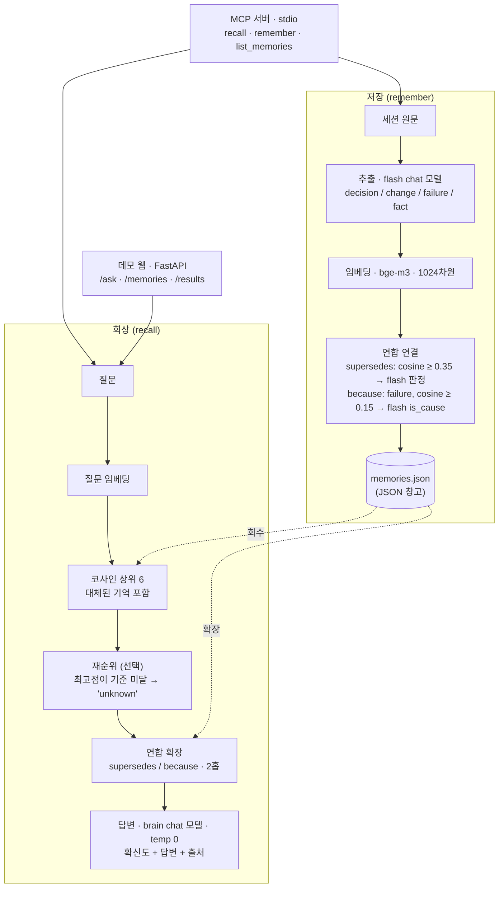

# Mnemosure

[English](README.md) | **한국어**

> 모르면 모른다고 하고, 아는 건 출처와 함께 말하는 AI 메모리 레이어.

여러 세션에 걸친 AI 협업에서는 두 가지 실패가 겹친다. 내렸던 결정을 **잊어버리고**, 내린 적 없는 결정을 **지어낸다**. Mnemosure는 이 둘을 동시에 공략하는 출처 기반 메모리 레이어다.

핵심 주장: **기억하지 못하는 것을 지어내지 않고, 기억한 것은 빠뜨리지 않는다.**

API 키 하나([OpenRouter](https://openrouter.ai))로 파이프라인 전체가 돈다 — chat·임베딩·rerank 모델을 원하는 대로 고르고(Claude, GPT, Qwen, …), 임베딩은 키 없이 로컬로 돌릴 수도 있다.


*데모 UI. 회상 곡선에서 Mnemosure(파랑)는 세션이 쌓여도 초기 질문에 계속 정답을 유지하고, 요약 핸드오프(빨강)는 0으로 무너진다. 아래 표는 질문별로 각 시스템의 실제 답변 행동을 라벨로 보여준다 — 초록=정확, 빨강=환각, 회색=누락.*

---

## 무엇을 하나

- 대화에서 오래 남을 것 — 결정·변경·실패·확정된 사실 — 만 **저장**하고 잡담은 버린다.
- 시간에 따라 기억을 **연결**한다. 새 결정이 옛 결정을 갈아엎으면 옛것을 `superseded`(대체됨)로 표시하고, 어떤 변경의 *이유*를 그 원인이 된 실패(`because`)에 이어둔다.
- 확신도와 출처를 붙여 **회상**한다. 증거가 옛 기억을 대체하면 옛 사실을 되풀이하지 않고 *바로잡는다*. 증거가 없으면 지어내지 않고 *"기록에 없다"* 고 답한다.

모든 답은 세 확신도 — **certain / vague / unknown** — 중 하나로, 인용한 각 기억의 출처와 함께 돌아온다.

## 아키텍처


```mermaid
flowchart TB
    MCP["MCP 서버 · stdio<br/>recall · remember · list_memories"]
    WEB["데모 웹 · FastAPI<br/>/ask · /memories · /results"]

    subgraph Ingest["저장 (remember)"]
        direction TB
        S["세션 원문"] --> EX["추출 · flash chat 모델<br/>decision / change / failure / fact"]
        EX --> EMB1["임베딩 · bge-m3 · 1024차원"]
        EMB1 --> LINK["연합 연결<br/>supersedes: cosine ≥ 0.35 → flash 판정<br/>because: failure, cosine ≥ 0.15 → flash is_cause"]
        LINK --> STORE[("memories.json<br/>(JSON 창고)")]
    end

    subgraph Recall["회상 (recall)"]
        direction TB
        Q["질문"] --> EMB2["질문 임베딩"]
        EMB2 --> COS["코사인 상위 6<br/>대체된 기억 포함"]
        COS --> RR["재순위 (선택)<br/>최고점이 기준 미달 → 'unknown'"]
        RR --> EXP["연합 확장<br/>supersedes / because · 2홉"]
        EXP --> ANS["답변 · brain chat 모델 · temp 0<br/>확신도 + 답변 + 출처"]
    end

    MCP --> S
    MCP --> Q
    WEB --> Q
    STORE -. 회수 .-> COS
    STORE -. 확장 .-> EXP
```

**저장** (`mnemosure/memory/store.py`): 세션을 flash chat 모델에 넘겨 '나중에 중요해질 것'만 추출한다. 각 기억을 임베딩한 뒤 두 종류의 연합을 긋는다 — 어휘 유사도(코사인) 1차 거름망이 후보를 제안하고 flash 모델이 최종 판정하므로, 표면 유사성만으로 잇지 않는다. 실패는 절대 대체되지 않는다(교훈은 영구 보존).

**회상** (`mnemosure/memory/recall.py`): 질문을 임베딩해 상위 후보를 모은다 — *대체된 기억도 포함해서*. 낡은 믿음을 바로잡으려면 먼저 찾아야 하기 때문이다. 재순위 모델이 관련도 순으로 다시 세우고, 최고점조차 기준에 못 미치면 지어내는 대신 **unknown**으로 답한다. 살아남은 씨앗을 `supersedes`/`because` 링크로 2홉 확장하고, brain 모델이 **그 증거에만 근거해**(temperature 0) 답을 구성한다. "전부 요약해줘"류 질문은 top-K를 건너뛰고 활성 기억 전체에 근거한다(누락 방지).

## 모델 — 네 역할, 무거운 쪽은 내 컴퓨터가 기본

| 역할 | 기본 모델 | 어디서 도나 | 키 |
|---|---|---|---|
| 색인 (임베딩, 1024차원) | `intfloat/multilingual-e5-large` | **내 컴퓨터** | 불필요 |
| 정밀 재순위 | `jinaai/jina-reranker-v2-base-multilingual` | **내 컴퓨터** | 불필요 |
| Brain (답변 생성) | `qwen/qwen3.7-plus` | OpenRouter | 필요 |
| Flash (추출·연결 판정) | `qwen/qwen3.7-flash` | OpenRouter | 필요 |

**대화 원문은 밖으로 나가지 않는다.** 기억을 벡터로 만들고 찾아내는 일은 전부 내 컴퓨터에서 하고,
밖으로 가는 것은 질문 하나에 답을 짜는 호출뿐이다. 양이 많은 쪽이 로컬이라 실제 비용도 거의 안 든다.

첫 실행 때 모델 가중치 약 3.4GB(임베딩 2.24 + 재순위 1.11)를 Hugging Face에서 한 번 받아 캐시한다
— 이후로는 네트워크 없이 돈다.

**속도는 장비에 딸려 있다.** fastembed 는 기본이 CPU다. 실측(맥북 CPU)으로 임베딩이 초당 2.8개라,
기억이 많으면 첫 색인이 길어진다 — 1천 건에 6분, 2만 건에 2시간쯤이다. 대응이 셋 있다:

```bash
MNEMOSURE_LOCAL_THREADS=8         # CPU 스레드 늘리기 (GPU가 없을 때)
MNEMOSURE_LOCAL_CUDA=1            # CUDA 사용 (onnxruntime-gpu 설치 필요)
MNEMOSURE_LOCAL_DEVICE_IDS=0,1    # 쓸 GPU 번호
```

CUDA가 아닌 장비(AMD·ROCm 등)는 표준 onnxruntime 이 지원하지 않으므로, **임베딩만 그 장비의
추론 서버로 보내는 편이 낫다** — `MNEMOSURE_EMBED_PROVIDER=api` + `MNEMOSURE_EMBED_BASE_URL`
(아래 "임베딩만 다른 서버로"). 색인 자체는 여전히 내 장비에서 돌고 바깥으로는 안 나간다.

아예 게이트웨이에 맡기려면 아래 "전부 게이트웨이로"를 보면 된다.

### 역할별로 어디서 돌릴지 고르기

| 무엇을 | env | 기본 | 다른 값 |
|---|---|---|---|
| 임베딩을 어디서 | `MNEMOSURE_EMBED_PROVIDER` | `local` | `api` → 게이트웨이 |
| 재순위를 어디서 | `MNEMOSURE_RERANK_PROVIDER` | `local` | `api` → 게이트웨이 |
| 게이트웨이 주소 | `MNEMOSURE_BASE_URL` | OpenRouter | 아무 OpenAI 호환 서버 |
| 게이트웨이 키 | `MNEMOSURE_API_KEY` | — | (`OPENROUTER_API_KEY`도 읽음) |

모델 이름은 역할마다 따로 바꾼다. `local`과 `api`가 **서로 다른 변수를 본다**:

| 역할 | `local`일 때 | `api`일 때 |
|---|---|---|
| 임베딩 | `MNEMOSURE_MODEL_EMBED_LOCAL` | `MNEMOSURE_MODEL_EMBED` |
| 재순위 | `MNEMOSURE_MODEL_RERANK_LOCAL` | `MNEMOSURE_MODEL_RERANK` |
| Brain | — | `MNEMOSURE_MODEL_BRAIN` |
| Flash | — | `MNEMOSURE_MODEL_FLASH` |

### 조합 네 가지

**1. 그대로 쓰기** — 키 하나만 넣으면 끝. 색인은 로컬, 답변만 게이트웨이.

```bash
OPENROUTER_API_KEY=sk-or-...
```

**2. 전부 내 장비에서 (키 없이)** — Ollama·vLLM 같은 OpenAI 호환 서버에 채팅 모델을 올려 두고 그쪽을 가리킨다.
임베딩·재순위는 이미 로컬이므로 **바깥으로 나가는 호출이 0이 된다.**

```bash
MNEMOSURE_BASE_URL=http://<내-GPU호스트>:11434/v1
MNEMOSURE_API_KEY=ollama          # 키를 안 보는 서버라도 SDK가 값을 요구한다
MNEMOSURE_MODEL_BRAIN=<올려 둔 모델>
MNEMOSURE_MODEL_FLASH=<올려 둔 모델>
```

**3. 전부 게이트웨이로** — GPU가 없어 첫 색인이 느릴 때. 0.4.0 이전의 기본과 같은 상태가 된다.

```bash
MNEMOSURE_EMBED_PROVIDER=api
MNEMOSURE_RERANK_PROVIDER=api
OPENROUTER_API_KEY=sk-or-...
```

**4. 무료 모드 (크레딧 없이)** — 크레딧을 안 산 OpenRouter 계정도 `:free` 표시가 붙은
모델은 부를 수 있다. 스위치 하나로 brain·flash 기본값이 무료 모델로 바뀐다:

```bash
MNEMOSURE_FREE=1
OPENROUTER_API_KEY=sk-or-...
```

역할별 `MNEMOSURE_MODEL_BRAIN` / `MNEMOSURE_MODEL_FLASH` 지정은 무료 기본값보다 여전히
우선한다. 주의 둘: 무료 모델은 **하루 요청 수 제한**이 있고(크레딧 미구매 기준 50회/일 —
`remember` 한 번에 호출이 여러 번 나가므로 활발한 날엔 닿을 수 있다), 무료 목록은
**수시로 바뀐다** — 기본값이 사라지면 [openrouter.ai/models](https://openrouter.ai/models?q=free)에서
골라 역할별 변수로 지정한다.

> **임베딩 방식을 바꾸면 창고를 한 번 다시 계산해야 한다.** `local`과 `api`의 기본 모델이 서로
> 다른 벡터를 만들기 때문이다. 실행하면 안내가 뜨고, `python -m mnemosure.reembed`로 옮기면 된다
> — 자세히는 아래 "임베딩 모델 교체".

### 알아 둘 것 둘

**재순위를 `api`로 두고 `BASE_URL`만 로컬 서버로 바꾸면 재순위가 깨진다.** OpenAI 호환 규격에는
재순위 라우트가 없어서 같은 호스트의 `/rerank`를 직접 부르는데(Cohere 관례 형식), 일반 로컬 추론
서버는 그 경로를 내주지 않는다. `BASE_URL`을 옮길 때는 재순위를 `local`로 두면 된다(기본값이다).
아예 끄려면 `MNEMOSURE_RERANK=off` — 그러면 순위·정직 게이트가 1차 코사인 점수를 쓴다.

**정직 게이트 문턱은 점수를 낸 모델에 딸려 있다.** 회상은 "가장 관련 있어 보이는 기억의 점수"가
문턱보다 낮으면 답변 모델을 부르지 않고 "기록에 없다"로 끝낸다. 이 판정이 **어느 모델의 점수를
보는지가 재순위를 켰는지에 따라 갈린다** — 그래서 문턱도 둘이고, 다시 잡아야 하는 조건도 다르다.

| 재순위 | 문턱이 보는 점수 | 쓰이는 변수 | 기본값 |
|---|---|---|---|
| 켜짐 (기본) | **재순위 모델**이 낸 관련도 | `MNEMOSURE_RERANK_FLOOR` | `local` 0.20 · `api` 0.15 |
| 껐음 (`MNEMOSURE_RERANK=off`) | **임베딩 모델**의 코사인 | `MNEMOSURE_COSINE_FLOOR` | `local` 0.85 · `api` 0.35 |

두 기본값이 크게 다른 이유는 임베딩 모델마다 코사인 분포가 완전히 달라서다. e5(로컬 기본)는
**무관한 쌍도 0.83이 나온다** — 실측(1,503조각, 후보 40개 중 최상위)에서 정답 있음 중앙값 0.88,
없음 중앙값 0.83이었다. 여기에 0.35를 쓰면 아무것도 걸러지지 않는다(없는데 답함 100%).
그렇다고 0.85가 넉넉한 값도 아니다 — 두 분포가 크게 겹쳐서 그 지점에서도 있는데 "모른다" 23%,
없는데 답함 13%다. **코사인만으로는 게이트가 약하므로 재순위를 켜 두는 것이 기본이다.**

**언제 다시 잡아야 하나:**

| 무엇을 바꿨나 | 다시 잡을 값 |
|---|---|
| 재순위 모델 (`MODEL_RERANK` / `MODEL_RERANK_LOCAL`) | `RERANK_FLOOR` |
| 재순위 공급 방식 (`RERANK_PROVIDER`) | `RERANK_FLOOR` — 기본값이 방식별로 다르니, 직접 지정해 뒀다면 그 값을 다시 본다 |
| 임베딩 모델 — **재순위를 켜 둔 경우** | **없음.** 재순위 점수는 질문과 문서를 같이 읽고 낸 값이라 임베딩과 무관하다 |
| 임베딩 모델 — **재순위를 끈 경우** | `COSINE_FLOOR` — 이때는 문턱이 임베딩 코사인을 보므로 모델이 바뀌면 분포가 달라진다 |

즉 **임베딩 모델을 바꿀 계획이면 재순위를 켜 두는 편이 편하다.** 문턱을 다시 잡을 일이 없어진다.
반대로 재순위를 끈 상태에서 임베딩을 바꾸면 문턱과 모델이 어긋난 채로 돌게 된다.

문턱이 너무 높으면 있는 기억도 "기록에 없다"로 나가고, 너무 낮으면 엉뚱한 근거로 답한다.
어느 쪽으로 틀렸는지는 회상 결과의 후보 점수를 보면 안다 — `recall` 응답에 최상위 점수가 함께 온다.

기본 두 재순위 모델이 내는 점수의 자가 실제로 다르다: 게이트웨이 모델은 0~1 관련도를 주는데
로컬 교차인코더는 로짓(실측 -3.7~+3.4)을 낸다. 그래서 로컬 갈래는 시그모이드로 0~1로 옮겨
같은 자를 보게 하고, 그러고도 분포가 달라 문턱은 방식별로 따로 실측한 값을 쓴다.

**e5 접두어는 기본으로 붙이지 않는다.** e5 계열은 질문 앞에 `query: `, 문서 앞에 `passage: `를
붙여 훈련된 모델이고 모델 문서도 그렇게 쓰라고 한다. 그런데 같은 자료로 맞대보니 **회수가 나빠졌다**:

| 후보 수 | 접두어 없음 | 접두어 붙임 |
|---|---|---|
| 상위 6 | 72.8% | 66.0% |
| 상위 40 | 85.4% | 81.6% |

여섯 개 후보 수 전부에서 나빠졌고 정답 순위 75%지점이 9위에서 20위로 밀렸다. fastembed 가 이미
붙여서 중복이 된 것도 아니다(e5 는 접두어 전처리 없이 평균 풀링만 한다). 그래서 기본은 끔이다.

단, 위 측정에서 쓴 '질문'은 결론 요약문이라 서술문에 가깝다. 실제 회상 질문은 의문문이므로 다른
결과가 나올 수 있다. 자기 문항으로 재보려면 `MNEMOSURE_E5_PREFIX=on` — 켜면 벡터가 달라지므로
창고 id에 표시가 붙고, 섞이려 하면 실행이 거부된다.

### 회수 후보 수

`MNEMOSURE_CANDIDATE_K`(기본 40)는 1차 검색이 남길 후보 수다. **여기서 잘린 기억은 재순위도
정직 게이트도 볼 수 없다** — 좁게 잡으면 창고가 커질수록 "있는데 못 찾는" 답이 늘고, 그것이
"기록에 없다"로 나가서 정직한 답과 구별되지 않는다. 실측(연구노트 7,340조각, 정답 회수율):

| 창고 크기 | 후보 6개 | 후보 40개 | 후보 100개 |
|---|---|---|---|
| 19조각 | 95.8% | 100.0% | 100.0% |
| 1,000조각 | 75.7% | 86.1% | 93.2% |
| 7,340조각 | 60.2% | 75.7% | 82.5% |

창고가 클수록 후보를 늘리는 값이 커진다. 기억이 수만 건을 넘으면 더 올려 보고,
반대로 아주 작은 창고에서 응답을 빠르게 하려면 낮춰도 된다.

API 키는 **오직** 환경변수(또는 `.env`)에서만 읽고 절대 하드코딩하지 않는다.
기본값은 `mnemosure/config.py`(단일 출처)에 있다.

## 설치

```bash
pip install mnemosure          # 코어 제품: 메모리 라이브러리 + MCP 서버
```

임베딩·재순위는 내 컴퓨터에서 돌지만 **답변 생성은 모델이 필요하다.**
게이트웨이를 쓸 거면 [OpenRouter 키](https://openrouter.ai/keys)를 넣는다
(자기 서버에 채팅 모델을 올려 뒀다면 위 "조합 세 가지"의 2번을 보면 된다):

```bash
export OPENROUTER_API_KEY=sk-or-...
mnemosure-mcp                  # stdio MCP 서버
```

- **기억 저장 위치:** 설치본은 `~/.mnemosure/memories.json`의 *빈* 창고로 시작한다. `MNEMOSURE_DATA_DIR`로 폴더를 직접 바꾸거나, `MNEMOSURE_SCOPE`로 범위를 고를 수 있다 — `user`는 모든 프로젝트가 `~/.mnemosure` 창고 하나를 공유하고, `project`는 프로젝트(서버가 뜬 폴더)마다 `.mnemosure/`를 따로 쓴다. MCP 서버를 등록할 때 등록 범위와 맞춰 두면 편하다.
- pip 패키지는 **제품만** 담는다(`config`, `llm`, `mcp_server`, `reembed`, `memory/`). 웹 데모·평가 하네스는 이 레포에 있다(클론해서 실행).

### 로컬 모델 (기본 · 추가 설치 없음)

임베딩과 재순위는 [fastembed](https://github.com/qdrant/fastembed)로 내 컴퓨터에서 계산한다.
fastembed는 본 의존성에 들어 있어 `pip install mnemosure`만으로 준비된다.

```
임베딩  intfloat/multilingual-e5-large              2.24GB · 1024차원
재순위  jinaai/jina-reranker-v2-base-multilingual   1.11GB · 한국어 포함
```

모델 가중치는 패키지에 **미포함** — 첫 사용 때 Hugging Face에서 한 번 받아 캐시한다.
이후로는 네트워크 없이 돈다(막힌 망에서는 fastembed 캐시 폴더에 수동 배치).

게이트웨이로 돌리고 싶으면 `MNEMOSURE_EMBED_PROVIDER=api` / `MNEMOSURE_RERANK_PROVIDER=api`.

### 임베딩 모델 교체 (마이그레이션)

다른 임베딩 모델의 벡터는 섞이지 않는다 — 창고가 자신을 만든 모델을 기록하고 있어서, 불일치하면 조용히 망가지는 대신 실행을 거부하고 안내한다. 모델을 바꿀 때(api↔local 포함)는 한 번 재임베딩한다:

```bash
python -m mnemosure.reembed                      # 기본 창고
python -m mnemosure.reembed path/to/memories.json
```

## 빠른 시작 (소스에서)

```bash
# 1) 프로젝트 가상환경 생성·활성화
python3 -m venv .venv
source .venv/bin/activate

# 2) 의존성 설치
pip install -r requirements.txt

# 3) 답변 생성용 키 설정 (임베딩·재순위는 로컬이라 키가 필요 없다)
cp .env.example .env        # .env 를 열어 OPENROUTER_API_KEY 설정

# 4) 네 가지 모델 역할 연결 확인
python scripts/check_models.py
```

## 데모 실행

레포에 **사전계산 스냅샷**(`data/scenarios/<key>/`)이 포함돼 있어 클론 직후 바로 돈다:

```bash
python scripts/run_demo.py      # → http://127.0.0.1:8000
```

**두 시나리오** — 장전 자동매매 봇, SaaS 구독 요금제 개편 — 를 전환하며 볼 수 있다. 각 시나리오의 **원본 대화**도 펼쳐볼 수 있어, 기억이 하드코딩이 아니라 실제 멀티세션 대화에서 *추출*됐음을 확인할 수 있다. 기억 창고·전후 비교 패널은 스냅샷을 그대로 렌더하므로 **키 없이** 볼 수 있다. `/ask`(라이브 회상)만 모델을 호출하므로 키가 필요하다. 스냅샷을 처음부터 다시 만들려면(크레딧 소모):

```bash
python scripts/gen_demo_data.py            # 전체 시나리오(없는 것만)
python scripts/gen_demo_data.py pricing    # 특정 시나리오
```

## MCP 서버로 쓰기

Mnemosure는 **Model Context Protocol**로 메모리 레이어를 노출한다. MCP를 지원하는 에이전트(Claude Desktop, Claude Code, Codex, …)라면 도구로 호출할 수 있다.

```bash
mnemosure-mcp                       # pip 설치 시
python -m mnemosure.mcp_server      # 소스 체크아웃에서 동일
```

에이전트의 `.mcp.json`(또는 동급 설정)에 등록한다. `pip install mnemosure` 후에는 콘솔 명령이면 충분하다:

```json
{
  "mcpServers": {
    "mnemosure": {
      "command": "mnemosure-mcp",
      "env": { "OPENROUTER_API_KEY": "sk-or-..." }
    }
  }
}
```

위 `.mcp.json`은 어느 MCP 클라이언트에서나 동작한다. **Claude Code**라면 한 줄로 등록할 수 있다:

```bash
claude mcp add mnemosure --env OPENROUTER_API_KEY=sk-or-... -- mnemosure-mcp
```

**[uv](https://docs.astral.sh/uv/)로 무설치 실행** — `pip install` 없이 PyPI에서 바로 실행한다(콘솔 명령 `mnemosure-mcp`가 패키지 이름 `mnemosure`와 달라 `--from`이 필요):

```json
{
  "mcpServers": {
    "mnemosure": {
      "command": "uvx",
      "args": ["--from", "mnemosure", "mnemosure-mcp"],
      "env": { "OPENROUTER_API_KEY": "sk-or-..." }
    }
  }
}
```

> 설치본이 아니라 소스 체크아웃에서 돌린다면 `"command": "/abs/path/.venv/bin/python"`, `"args": ["-m", "mnemosure.mcp_server"]`에 `"PYTHONPATH": "/abs/path/to/repo"`를 더해, 실행 위치와 무관하게 패키지를 임포트할 수 있게 한다.

도구:

| 도구 | 시그니처 | 반환 |
|---|---|---|
| `recall` | `recall(query: str)` | `{confidence, answer, cited}` — 출처 기억 id가 달린 근거 기반 답변 |
| `remember` | `remember(session_text: str, date="", title="")` | `{stored: [...], count}` — 결정·변경·실패 추출, supersedes/because 자동 연결 |
| `list_memories` | `list_memories(include_superseded=False)` | 활성(또는 전체) 기억 목록(출처 포함) |

> 참고: 서버 자신이 분류·회상·근거화를 위해 설정된 모델을 호출한다 — 에이전트에는 중립적이지만 **API 키가 있다는 전제**로 동작한다(env 또는 `.env`).

## 평가 방식

품질은 단일 점수가 아니라 답변별 **행동** 라벨 — 정확 / 누락 / 환각 / 잡음 / 정직 — 과 3단 **확신도**(certain/vague/unknown)로 측정한다. 파이프라인 전체(추출·대체 판정·채점)는 재현성을 위해 **temperature 0**으로 돈다. 데모는 고정 스냅샷을 서빙하므로 볼 때마다 결과가 같다.

내장 시나리오 2종(총 19문항 — 자동매매 봇 8, 구독 요금제 11) 기준, 스냅샷의 라벨 집계는 다음과 같다:

| 행동 | Mnemosure | 요약 핸드오프 | 단순 RAG |
|---|---|---|---|
| 정확 | **17** | 4 | 4 |
| 정직("기록에 없다") | **2** | 2 | 2 |
| 누락(잊음) | 0 | 11 | 7 |
| 환각(지어냄) | 0 | 1 | 6 |
| 잡음(동문서답) | 0 | 1 | 0 |

이 수치는 벤치마크가 아니라 데모로 읽어야 한다: 시나리오와 정답 키는 자체 제작(가상)이고, 행동 라벨은 LLM 저지가 판정했으며, 스냅샷은 Qwen Cloud 모델 조합으로 측정했다(데모 UI에 명시). 세 시스템 모두 같은 brain 모델로 답했다 — 다른 것은 그 앞에 놓인 기억뿐이다.

`mnemosure/evaluation/` 참고 (`harness.py`, `judge.py`, `label.py`, `baseline.py`, `answer_key.py`).

## 프로젝트 구조

```
mnemosure/
  config.py           # 게이트웨이·모델·키 로딩 — 단일 출처
  llm.py              # 모델로 가는 유일한 통로 (chat / embed / rerank, 로컬 임베딩)
  mcp_server.py       # MCP 도구: recall · remember · list_memories (stdio)
  reembed.py          # 창고 일괄 재임베딩 (임베딩 모델 마이그레이션)
  memory/
    store.py          # 저장: 추출 → 임베딩 → supersedes/because 연결 → 저장
    recall.py         # 회상: 임베딩 → 재순위 → 연합 확장 → 근거 기반 답변
    forget.py         # 망각/관련성 처리
    storage.py        # JSON 파일 기억 창고 (자신을 만든 임베딩 모델을 기록)
    models.py         # Memory / Association / Source 데이터클래스
  evaluation/         # harness · judge · label · baseline · answer_key
  demo/
    server.py         # FastAPI: /ask · /memories · /results · /sessions · /scenarios
    index.html        # 단일 페이지 데모 UI (시나리오 전환 + 원본 대화 뷰어)
    scenarios.py      # 시나리오 레지스트리 (세션 + 정답셋 + 스냅샷 경로)
    sample_sessions.py# 데모·평가용 가상 시나리오 (자동매매 봇, 구독 요금제)
scripts/              # check_models · gen_demo_data · run_demo · demo_* 헬퍼
data/scenarios/<key>/ # 시나리오별 memories.json + results.json (데모 스냅샷, 커밋됨)
```

## 배포

데모에는 `Dockerfile`이 포함된다(단일 컨테이너, 소스+사전계산 스냅샷; API 키는 실행 시 주입, 절대 이미지에 굽지 않음). 어떤 Docker 호스트에서든 돈다. 로컬 빠른 실행:

```bash
docker build -t mnemosure-demo .
docker run -p 8000:8000 -e OPENROUTER_API_KEY=sk-or-... mnemosure-demo
# → http://127.0.0.1:8000  (헬스체크: /health)
```

## 0.4.0에서 올라오기

0.4.1은 **기존 창고를 건드리지 않는다.** 0.4.0으로 만든 창고는 그대로 열린다.

- **재순위를 끈 경로의 코사인 문턱을 고쳤다.** 0.4.0에서 임베딩 기본이 e5로 바뀌었는데 문턱은
  bge-m3 기준인 0.35로 남아 있었다. e5 코사인은 무관한 쌍도 0.83이 나오므로,
  `MNEMOSURE_RERANK=off` 로 쓰던 사람은 **정직 게이트가 한 번도 닫히지 않는 상태**였다.
  이제 기본이 방식별로 갈린다(`local` 0.85 · `api` 0.35). 기본 경로(재순위 켜짐)는 영향 없다.
- **e5 접두어 스위치가 생겼다**(`MNEMOSURE_E5_PREFIX`, 기본 끔). 켜 보고 재봤는데 회수가
  나빠져서 기본은 끔으로 뒀다 — 위 "알아 둘 것" 참고.

## 0.3.x에서 올라오기 (호환성 변경)

0.4.0은 **임베딩·재순위의 기본을 내 컴퓨터로** 옮겼다(전에는 둘 다 게이트웨이).

- **기존 창고는 그대로 열리지 않는다.** 기본 임베딩 모델이 `baai/bge-m3` → `intfloat/multilingual-e5-large`로 바뀌어 벡터가 다르다. 실행하면 어느 변수를 어떻게 두라는 안내가 뜬다. 둘 중 하나를 고르면 된다:
  - **그대로 쓰기** — `MNEMOSURE_EMBED_PROVIDER=api` 와 `MNEMOSURE_MODEL_EMBED=baai/bge-m3` (0.3.x와 같은 상태)
  - **로컬로 옮기기** — `python -m mnemosure.reembed` 한 번
- **재순위 기본도 로컬이 됐다.** 게이트웨이로 되돌리려면 `MNEMOSURE_RERANK_PROVIDER=api`.
- **정직 게이트 문턱 기본값이 방식마다 다르다** — `api` 0.15, `local` 0.20 (모델이 내는 점수 척도가 달라서다). 직접 지정한 `MNEMOSURE_RERANK_FLOOR`가 있으면 그 값이 우선한다.
- **회수 후보 수 기본이 6 → 40**으로 올랐다(`MNEMOSURE_CANDIDATE_K`). 창고가 커질 때 "있는데 못 찾는" 답을 줄이기 위함이다.
- **fastembed가 본 의존성이 됐다** — `pip install "mnemosure[local]"`는 이제 필요 없다(`[local]`은 빈 별칭으로 남겨 뒀다). 첫 실행 때 모델 가중치 약 3.4GB를 한 번 받는다.

## 0.2.x에서 올라오기 (호환성 변경)

0.3.0은 Qwen Cloud(DashScope) 연동을 단일 OpenAI 호환 게이트웨이(기본: OpenRouter)로 교체했다:

- **키**: `DASHSCOPE_API_KEY`는 더 이상 읽지 않는다 — `OPENROUTER_API_KEY`를 설정한다(다른 게이트웨이는 `MNEMOSURE_BASE_URL` + `MNEMOSURE_API_KEY`).
- `recall` 응답의 **확신도 토큰**이 영어로 바뀌었다: `certain` / `vague` / `unknown` (구 확실/어렴풋/모름).
- 0.2.x로 만든 **창고**(`text-embedding-v4` 벡터)는 한 번 재임베딩해야 한다: `python -m mnemosure.reembed`.

## 라이선스

[MIT](LICENSE).
