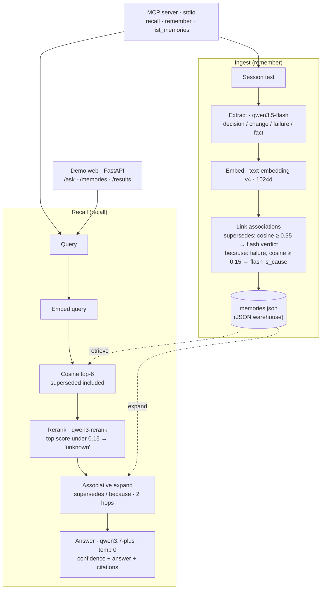

# Mnemosure

**English** | [한국어](README.ko.md)

> An AI memory layer that says *"I don't know"* when it doesn't, and cites its source when it does.
> Qwen Cloud Global AI Hackathon · **Track 1 (MemoryAgent)**

Across many sessions of AI-assisted work, two failures compound: the assistant **forgets** decisions that were made, and it **hallucinates** ones that were not. Mnemosure is a source-grounded memory layer that attacks both.

Its core claim: **it does not invent what it cannot remember, and it does not drop what it remembers.**

---

## What it does

- **Stores** durable facts from a conversation — decisions, changes, failures, established facts — and throws away the chatter.
- **Links** memories over time: when a new decision overrides an old one, the old one is marked `superseded`; the *reason* for a change is linked back to the failure that caused it (`because`).
- **Recalls** with a confidence level and citations. When the evidence overrides an old memory, the answer *corrects* the old fact instead of repeating it. When there is no evidence, it answers *"not in the record"* instead of guessing.

Every answer comes back as one of three confidence levels — **certain / vague / unknown** — with the source of each cited memory.

## Architecture



**Ingest** (`mnemosure/memory/store.py`): a session is passed to `qwen3.5-flash`, which extracts only what will matter later. Each memory is embedded, then two kinds of association are drawn — a lexical prefilter (cosine similarity) proposes candidates and the flash model makes the final call, so nothing is linked on surface similarity alone. Failures are never superseded (lessons are kept forever).

**Recall** (`mnemosure/memory/recall.py`): the query is embedded and the top candidates are pulled — *including superseded ones*, because correcting a stale belief requires finding it first. `qwen3-rerank` re-orders by relevance; if even the best hit is too weak, the answer is **unknown** rather than a guess. The surviving seeds are expanded two hops along their `supersedes`/`because` links, and `qwen3.7-plus` composes the final answer **grounded only in that evidence** (temperature 0). Broad "summarize everything" questions bypass top-K and ground on all active memories so nothing is dropped.

## Models (Qwen Cloud / DashScope)

| Role | Model | Endpoint |
|---|---|---|
| Brain (main answer) | `qwen3.7-plus-2026-05-26` | OpenAI-compatible `/compatible-mode/v1` |
| Brain (extract / judge / classify) | `qwen3.5-flash` | OpenAI-compatible `/compatible-mode/v1` |
| Index (embeddings, 1024-dim) | `text-embedding-v4` | OpenAI-compatible `/compatible-mode/v1` |
| Precision rerank | `qwen3-rerank` | Native `/api/v1/services/rerank/...` |

The API key is read **only** from the environment (or `.env`) and is never hard-coded. Model IDs default to the values above; override them per-run with `MNEMOSURE_MODEL_*` env vars if a quota runs out — there is no automatic switching. Defaults live in `mnemosure/config.py` (the single source of truth).

## Install

```bash
pip install mnemosure          # core library + MCP server
pip install "mnemosure[demo]"  # also pulls FastAPI/uvicorn for the demo web server
```

Then provide your Qwen Cloud key (`export DASHSCOPE_API_KEY=...`) and run the MCP server:

```bash
mnemosure-mcp                  # stdio MCP server
```

- **A Qwen key is required at runtime** — Mnemosure is a Qwen client (extraction, embeddings, rerank, answering all run on Qwen). Without a key the tools raise a clear error.
- **Where memories are stored:** an installed copy starts with an *empty* warehouse at `~/.mnemosure/memories.json`. Override the directory with `MNEMOSURE_DATA_DIR`. (The pre-loaded NXTBot demo snapshot lives in this repository, not in the pip package — clone the repo to see it.)

## Quick start (from source)

```bash
# 1) create and activate a project virtual environment
python3 -m venv .venv
source .venv/bin/activate

# 2) install dependencies
pip install -r requirements.txt

# 3) provide your Qwen Cloud (DashScope) key
cp .env.example .env        # then edit .env and set DASHSCOPE_API_KEY

# 4) verify all four models are reachable
python scripts/check_models.py
```

## Run the demo

The repository **ships with precomputed demo snapshots** (under `data/scenarios/<key>/`), so the demo works right after cloning:

```bash
python scripts/run_demo.py      # → http://127.0.0.1:8000
```

It includes **two scenarios** — a pre-market trading bot and a mobile-app UI/UX redesign — that you can switch between. Each scenario also lets you expand its **source conversations**, so you can confirm the memories were *extracted* from real multi-session chats, not hardcoded. The memory warehouse and the before/after evaluation panels render straight from the snapshot — **no API key needed** to browse them. Only `/ask` (live grounded recall) calls Qwen and therefore needs a key. To regenerate a scenario's snapshot from scratch (consumes quota):

```bash
python scripts/gen_demo_data.py            # all scenarios (only missing ones)
python scripts/gen_demo_data.py uiux       # a specific scenario
```

## Use it as an MCP server

Mnemosure exposes the memory layer over the **Model Context Protocol**, so any MCP-capable agent (Claude Desktop, Claude Code, …) can call it as a tool.

```bash
mnemosure-mcp                       # if installed via pip
python -m mnemosure.mcp_server      # equivalent, from a source checkout
```

Register it in your agent's `.mcp.json` (or equivalent). After `pip install mnemosure`, the console command is enough:

```json
{
  "mcpServers": {
    "mnemosure": {
      "command": "mnemosure-mcp",
      "env": { "DASHSCOPE_API_KEY": "your-dashscope-api-key" }
    }
  }
}
```

> Running from a source checkout instead of an install? Use `"command": "/abs/path/.venv/bin/python"`, `"args": ["-m", "mnemosure.mcp_server"]`, and add `"PYTHONPATH": "/abs/path/to/repo"` so the package is importable regardless of the launcher's working directory.

Tools:

| Tool | Signature | Returns |
|---|---|---|
| `recall` | `recall(query: str)` | `{confidence, answer, cited}` — grounded answer with source-cited memory ids |
| `remember` | `remember(session_text: str, date="", title="")` | `{stored: [...], count}` — extracts decisions/changes/failures and auto-links supersedes/because |
| `list_memories` | `list_memories(include_superseded=False)` | list of active (or all) memories with source |

> Note: the server itself calls Qwen for classification, recall, and grounding — it is agent-agnostic but **assumes a Qwen key** is present (via env or `.env`).

## Evaluation approach

Quality is measured by labeling each answer's **behavior** — accurate / omission / hallucination / noise / honest — alongside our three-way **confidence** (certain / vague / unknown), rather than a single opaque score. The whole pipeline (extraction, supersession judgment, scoring) runs at **temperature 0** for reproducibility. The demo serves a fixed snapshot so results are stable across viewings.

See `mnemosure/evaluation/` (`harness.py`, `judge.py`, `label.py`, `baseline.py`, `answer_key.py`).

## Project structure

```
mnemosure/
  config.py           # models, endpoints, key loading — single source of truth
  qwen_client.py      # the only gateway to Qwen (chat / embed / rerank)
  mcp_server.py       # MCP tools: recall · remember · list_memories (stdio)
  memory/
    store.py          # ingest: extract → embed → link supersedes/because → save
    recall.py         # recall: embed → rerank → associative expand → grounded answer
    forget.py         # forgetting / relevance handling
    storage.py        # JSON-file memory warehouse
    models.py         # Memory / Association / Source dataclasses
  evaluation/         # harness · judge · label · baseline · answer_key
  demo/
    server.py         # FastAPI: /ask · /memories · /results · /sessions · /scenarios
    index.html        # single-page demo UI (scenario switcher + source-transcript viewer)
    scenarios.py      # scenario registry (sessions + answer keys + snapshot paths)
    sample_sessions.py# fictional scenarios (trading bot, UI/UX redesign) for demo & eval
scripts/              # check_models · gen_demo_data · run_demo · demo_* helpers
data/scenarios/<key>/ # per-scenario memories.json + results.json (demo snapshots, committed)
```

## Deployment

An Alibaba Cloud deployment guide (containerized) is being added in a follow-up commit.

## License

[MIT](LICENSE).
