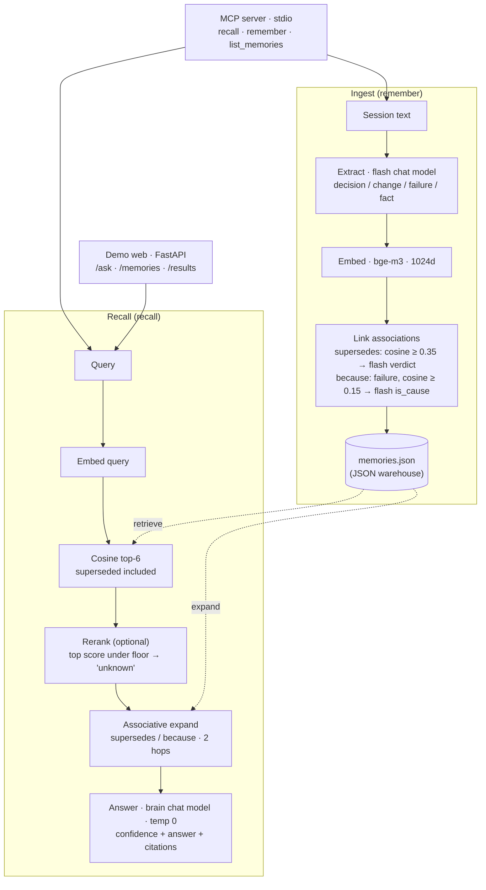

# Mnemosure

**English** | [한국어](README.ko.md)

> An AI memory layer that says *"I don't know"* when it doesn't, and cites its source when it does.

Across many sessions of AI-assisted work, two failures compound: the assistant **forgets** decisions that were made, and it **hallucinates** ones that were not. Mnemosure is a source-grounded memory layer that attacks both.

Its core claim: **it does not invent what it cannot remember, and it does not drop what it remembers.**

One API key ([OpenRouter](https://openrouter.ai)) drives the whole pipeline — pick any chat, embedding, and rerank model you like (Claude, GPT, Qwen, …), or compute embeddings locally with no key at all.

---

## What it does

- **Stores** durable facts from a conversation — decisions, changes, failures, established facts — and throws away the chatter.
- **Links** memories over time: when a new decision overrides an old one, the old one is marked `superseded`; the *reason* for a change is linked back to the failure that caused it (`because`).
- **Recalls** with a confidence level and citations. When the evidence overrides an old memory, the answer *corrects* the old fact instead of repeating it. When there is no evidence, it answers *"not in the record"* instead of guessing.

Every answer comes back as one of three confidence levels — **certain / vague / unknown** — with the source of each cited memory.

## Architecture



**Ingest** (`mnemosure/memory/store.py`): a session is passed to the flash chat model, which extracts only what will matter later. Each memory is embedded, then two kinds of association are drawn — a lexical prefilter (cosine similarity) proposes candidates and the flash model makes the final call, so nothing is linked on surface similarity alone. Failures are never superseded (lessons are kept forever).

**Recall** (`mnemosure/memory/recall.py`): the query is embedded and the top candidates are pulled — *including superseded ones*, because correcting a stale belief requires finding it first. The rerank model re-orders by relevance; if even the best hit is too weak, the answer is **unknown** rather than a guess. The surviving seeds are expanded two hops along their `supersedes`/`because` links, and the brain model composes the final answer **grounded only in that evidence** (temperature 0). Broad "summarize everything" questions bypass top-K and ground on all active memories so nothing is dropped.

## Models (via OpenRouter — swap freely)

All model calls go through one OpenAI-compatible gateway (default: OpenRouter). Defaults:

| Role | Default model | Override env |
|---|---|---|
| Brain (main answer) | `qwen/qwen3.7-plus` | `MNEMOSURE_MODEL_BRAIN` |
| Flash (extract / link verdicts) | `qwen/qwen3.5-flash-02-23` | `MNEMOSURE_MODEL_FLASH` |
| Index (embeddings, 1024-dim) | `baai/bge-m3` | `MNEMOSURE_MODEL_EMBED` |
| Precision rerank | `cohere/rerank-4-fast` | `MNEMOSURE_MODEL_RERANK` |

Point any of them at any OpenRouter model id (`anthropic/claude-sonnet-5`, `openai/gpt-…`, …). Two more switches:

- `MNEMOSURE_RERANK=off` — skip the rerank call entirely; ranking and the honesty gate then use the first-pass cosine scores. Cheaper, slightly less precise.
- `MNEMOSURE_BASE_URL` — use a different OpenAI-compatible gateway instead of OpenRouter (then set `MNEMOSURE_API_KEY`).

The honesty-gate thresholds (`MNEMOSURE_RERANK_FLOOR`, `MNEMOSURE_COSINE_FLOOR`) default to values calibrated for the default models above — if you swap the rerank or embedding model, re-check them on your own data.

The API key is read **only** from the environment (or `.env`) and is never hard-coded. Defaults live in `mnemosure/config.py` (the single source of truth).

## Install

```bash
pip install mnemosure          # the core product: memory library + MCP server
```

Then provide your [OpenRouter key](https://openrouter.ai/keys) and run the MCP server:

```bash
export OPENROUTER_API_KEY=sk-or-...
mnemosure-mcp                  # stdio MCP server
```

- **Where memories are stored:** an installed copy starts with an *empty* warehouse at `~/.mnemosure/memories.json`. Override the directory with `MNEMOSURE_DATA_DIR`.
- The pip package ships **only the product** (`config`, `llm`, `mcp_server`, `reembed`, `memory/`). The web demo and evaluation harness live in this repository (clone it to run them).

### Local embeddings (no key for the index)

```bash
pip install "mnemosure[local]"
export MNEMOSURE_EMBED_PROVIDER=local
```

Embeddings are then computed on your machine with [fastembed](https://github.com/qdrant/fastembed) (default model: `intfloat/multilingual-e5-large`, 1024-dim). The model weights are **not** bundled — they are downloaded once from Hugging Face on first use and cached (works offline afterwards; on a restricted network, pre-place the model in the fastembed cache dir). Chat and rerank still use the API key.

### Switching embedding models (migration)

Vectors from different embedding models don't mix — the warehouse records which model built it, and Mnemosure refuses to run on a mismatch instead of failing silently. To switch models (including api↔local), re-embed once:

```bash
python -m mnemosure.reembed                      # default warehouse
python -m mnemosure.reembed path/to/memories.json
```

## Quick start (from source)

```bash
# 1) create and activate a project virtual environment
python3 -m venv .venv
source .venv/bin/activate

# 2) install dependencies
pip install -r requirements.txt

# 3) provide your OpenRouter key
cp .env.example .env        # then edit .env and set OPENROUTER_API_KEY

# 4) verify all four model roles are reachable
python scripts/check_models.py
```

## Run the demo

The repository **ships with precomputed demo snapshots** (under `data/scenarios/<key>/`), so the demo works right after cloning:

```bash
python scripts/run_demo.py      # → http://127.0.0.1:8000
```

It includes **two scenarios** — a pre-market trading bot and a SaaS subscription-pricing revamp — that you can switch between. Each scenario also lets you expand its **source conversations**, so you can confirm the memories were *extracted* from real multi-session chats, not hardcoded. The memory warehouse and the before/after evaluation panels render straight from the snapshot — **no API key needed** to browse them. Only `/ask` (live grounded recall) calls the models and therefore needs a key. To regenerate a scenario's snapshot from scratch (consumes credits):

```bash
python scripts/gen_demo_data.py            # all scenarios (only missing ones)
python scripts/gen_demo_data.py pricing    # a specific scenario
```

## Use it as an MCP server

Mnemosure exposes the memory layer over the **Model Context Protocol**, so any MCP-capable agent (Claude Desktop, Claude Code, Codex, …) can call it as a tool.

```bash
mnemosure-mcp                       # if installed via pip
python -m mnemosure.mcp_server      # equivalent, from a source checkout
```

Register it in your agent's `.mcp.json` (or equivalent). After `pip install mnemosure`, the console command is enough:

```json
{
  "mcpServers": {
    "mnemosure": {
      "command": "mnemosure-mcp",
      "env": { "OPENROUTER_API_KEY": "sk-or-..." }
    }
  }
}
```

The `.mcp.json` above works with any MCP client. **Claude Code** users can skip the hand-editing and register it in one line:

```bash
claude mcp add mnemosure --env OPENROUTER_API_KEY=sk-or-... -- mnemosure-mcp
```

**Zero-install with [uv](https://docs.astral.sh/uv/)** — run it straight from PyPI without `pip install` (the console script `mnemosure-mcp` differs from the package name `mnemosure`, so pass `--from`):

```json
{
  "mcpServers": {
    "mnemosure": {
      "command": "uvx",
      "args": ["--from", "mnemosure", "mnemosure-mcp"],
      "env": { "OPENROUTER_API_KEY": "sk-or-..." }
    }
  }
}
```

> Running from a source checkout instead of an install? Use `"command": "/abs/path/.venv/bin/python"`, `"args": ["-m", "mnemosure.mcp_server"]`, and add `"PYTHONPATH": "/abs/path/to/repo"` so the package is importable regardless of the launcher's working directory.

Tools:

| Tool | Signature | Returns |
|---|---|---|
| `recall` | `recall(query: str)` | `{confidence, answer, cited}` — grounded answer with source-cited memory ids |
| `remember` | `remember(session_text: str, date="", title="")` | `{stored: [...], count}` — extracts decisions/changes/failures and auto-links supersedes/because |
| `list_memories` | `list_memories(include_superseded=False)` | list of active (or all) memories with source |

> Note: the server itself calls the configured models for classification, recall, and grounding — it is agent-agnostic but **assumes an API key** is present (via env or `.env`).

## Evaluation approach

Quality is measured by labeling each answer's **behavior** — accurate / omission / hallucination / noise / honest — alongside our three-way **confidence** (certain / vague / unknown), rather than a single opaque score. The whole pipeline (extraction, supersession judgment, scoring) runs at **temperature 0** for reproducibility. The demo serves a fixed snapshot so results are stable across viewings.

See `mnemosure/evaluation/` (`harness.py`, `judge.py`, `label.py`, `baseline.py`, `answer_key.py`).

## Project structure

```
mnemosure/
  config.py           # gateway, models, key loading — single source of truth
  llm.py              # the only gateway to models (chat / embed / rerank, local embeddings)
  mcp_server.py       # MCP tools: recall · remember · list_memories (stdio)
  reembed.py          # one-shot warehouse re-embedding (embedding-model migration)
  memory/
    store.py          # ingest: extract → embed → link supersedes/because → save
    recall.py         # recall: embed → rerank → associative expand → grounded answer
    forget.py         # forgetting / relevance handling
    storage.py        # JSON-file memory warehouse (records its embedding model)
    models.py         # Memory / Association / Source dataclasses
  evaluation/         # harness · judge · label · baseline · answer_key
  demo/
    server.py         # FastAPI: /ask · /memories · /results · /sessions · /scenarios
    index.html        # single-page demo UI (scenario switcher + source-transcript viewer)
    scenarios.py      # scenario registry (sessions + answer keys + snapshot paths)
    sample_sessions.py# fictional scenarios (trading bot, subscription pricing) for demo & eval
scripts/              # check_models · gen_demo_data · run_demo · demo_* helpers
data/scenarios/<key>/ # per-scenario memories.json + results.json (demo snapshots, committed)
```

## Deployment

The demo ships with a `Dockerfile` (single container, source + precomputed
snapshots; the API key is injected at run time, never baked in). It runs on any
Docker host. Quick local run:

```bash
docker build -t mnemosure-demo .
docker run -p 8000:8000 -e OPENROUTER_API_KEY=sk-or-... mnemosure-demo
# → http://127.0.0.1:8000  (health: /health)
```

## Upgrading from 0.2.x (breaking changes)

0.3.0 replaces the Qwen Cloud (DashScope) integration with a single OpenAI-compatible gateway (default: OpenRouter):

- **Key**: `DASHSCOPE_API_KEY` is no longer read — set `OPENROUTER_API_KEY` (or `MNEMOSURE_BASE_URL` + `MNEMOSURE_API_KEY` for another gateway).
- **Confidence tokens** in `recall` responses are now English: `certain` / `vague` / `unknown` (were 확실/어렴풋/모름).
- **Warehouses** built with 0.2.x (`text-embedding-v4` vectors) must be re-embedded once: `python -m mnemosure.reembed`.

## License

[MIT](LICENSE).
