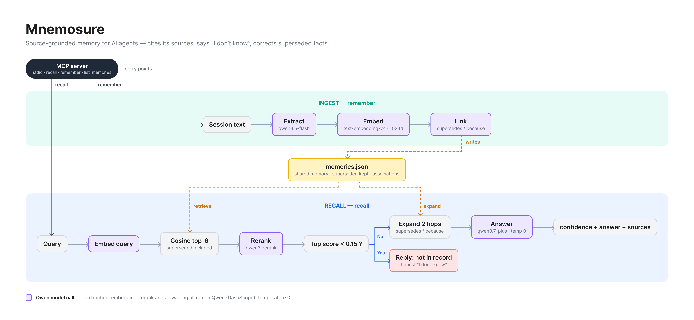
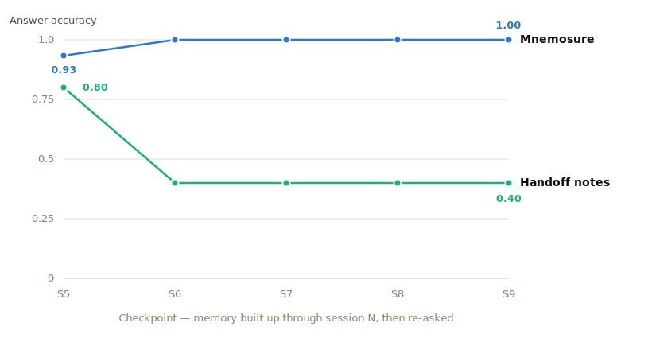
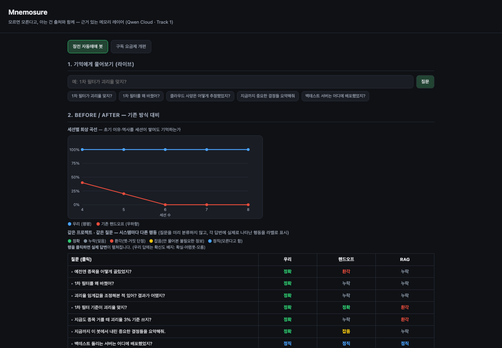

<!-- _class: lead -->
<!-- _paginate: false -->

# Mnemosure

**모르면 모른다고, 아는 건 출처와 함께 —<br>사실이 바뀌면 스스로 정정하는 AI 메모리.**

<br>

<span class="muted">Qwen Cloud Global AI Hackathon · Track 1 — MemoryAgent</span>
<span class="tiny">github.com/jsiksn/mnemosure · pypi.org/project/mnemosure</span>

---

## 문제 — 망각과 환각은 **서로를 부추긴다**

<div class="cols">
<div class="card">

### 잊어버린다
실제로 내린 결정이 조용히 사라집니다. 요약형 메모리는 현재 값은 남기지만, **왜** 그렇게 정했는지 — 이유와 역사 — 부터 버립니다.

</div>
<div class="card">

### 지어낸다
내린 적 없는 결정을 말합니다. 뒤집힌 지 오래된 낡은 사실을 **자신 있게** 단정합니다.

</div>
</div>

<br>

기억이 줄수록 빈틈을 지어내서 메웁니다 —
그래서 대부분의 "메모리" 기능은 두 실패를 **동시에 악화**시킵니다.

---

## 핵심 아이디어 — 메모리의 **세 가지 의무**

**기억하지 못하는 것을 지어내지 않고, 기억한 것은 빠뜨리지 않는다.**

<div class="cols">
<div class="card">

### 저장
나중에 중요해질 것만 — 결정·변경·실패·사실. 잡담은 버립니다.

</div>
<div class="card">

### 연결
새 결정은 옛것을 `superseded`로 표시하고, 변경의 **이유**는 원인이 된 실패에 잇습니다(`because`). 실패·교훈은 영구 보존.

</div>
<div class="card">

### 회상
**증거에만 근거해** 출처와 함께 답합니다. 낡은 사실은 정정하고, 증거가 없으면 **"기록에 없다"**.

</div>
</div>

모든 답변에는 확신도 — **확실 / 어렴풋 / 모름** — 와 인용한 기억의 출처가 붙습니다.

---

## 같은 질문, 다른 행동 <span class="muted">— 실제 데모 출력</span>

| 질문 | 베이스라인의 답 | Mnemosure의 답 |
|---|---|---|
| "Free 플랜 프로젝트 한도가 **3개** 맞지?" | <span class="bad">환각</span> — naive RAG: *"네, 3개 맞습니다."* (이미 뒤집힌 사실) | <span class="good">정정</span> — *"아니요, 지금은 **1개**로 바뀌었습니다 — 남용 사례가 확인되어 축소."* + 출처 |
| "Pro 요금을 **왜** 내렸어?" | <span class="bad">누락</span> — 핸드오프 노트: *"모릅니다."* (이유가 버려짐) | <span class="good">설명</span> — *"경쟁사 대비 비싸다는 피드백을 반영해 월 **12 → 9달러**로 인하."* + 출처 |
| "**학생 할인**은 얼마야?" *(어느 세션에도 없던 내용)* | 핸드오프·naive RAG: *"모릅니다."* — 여기선 둘 다 정직 | <span class="good">정직</span> — *"기록에 남아 있지 않습니다."* — 확신도 라벨 명시: **모름** |

<span class="tiny">커밋된 데모 스냅샷(`data/scenarios/pricing/results.json`)의 실제 동작을 요약 인용. 1–2행은 그 질문에서 실패한 베이스라인을 인용 — 시스템별 전체 성적은 결과 슬라이드 참조. 답변은 파이프라인이 생성하며 하드코딩되지 않았습니다.</span>

---

## 아키텍처 — **모든 모델 호출은 Qwen 위에서**



<span class="tiny">추출 `qwen3.5-flash` · 임베딩 `text-embedding-v4` (1024차원) · 재순위 `qwen3-rerank` · 답변 `qwen3.7-plus` — DashScope, temperature 0 (결정적 파이프라인).</span>

---

## 어떻게 **정정**하고, 어떻게 **정직**해지는가

- **낡은 기억을 일부러 찾습니다.** "Pro는 12달러"라는 옛 기억을 먼저 찾아야 "지금은 9달러"라고 고쳐 말할 수 있습니다. 그래서 회상은 대체된 기억을 숨기지 않고, 그것을 대체한 기억과 함께 가져옵니다.
- **증거가 약하면 답하지 않습니다.** 가장 관련 있는 기억조차 기준 점수에 못 미치면 <strong>"기록에 없다"</strong>고 답합니다. 추측을 거부하는 건 기능이지, 실패가 아닙니다.
- **기억의 연결은 판정으로 만듭니다.** 문장이 *비슷하다고* 잇는 게 아니라, 하나가 다른 하나를 실제로 *대체*하는지, *바뀐 이유*인지를 모델이 판단해서 잇습니다.
- **모든 문장은 증거 안에서만.** 답변은 회수한 기억만 사용할 수 있고, 주장마다 출처가 붙습니다.

---

## 결과 — 커밋된 스냅샷 실측값

| 시나리오 | Mnemosure | 핸드오프 노트 | naive RAG |
|---|---|---|---|
| 구독 요금제 개편 (11문) | **11/11** | 4/11 | 4/11 |
| 자동매매 봇 (8문) | **8/8** | 2/8 | 2/8 |

<br>

- 핸드오프는 현재 값은 남기지만 **이유를 버립니다** — "왜 바꿨어?" 유형을 전부 놓침
- naive RAG는 **낡은 숫자를 아직 참인 것처럼 단정**합니다 — 환각
- 베이스라인도 **같은 Qwen brain 모델**로 답변 — 차이는 모델 성능이 아니라 메모리 설계
- 모든 질문·답변·원본 대화를 데모에서 열람 가능 — 기억은 *추출*된 것이지 하드코딩이 아님

---

## 격차는 왜 계속 **벌어지는가**



핸드오프 노트는 **세션마다 다시 쓰입니다** — 나중 결정이 앞선 결정(과 그 *이유*)을 요약 밖으로 밀어내고, 한번 밀려난 것은 돌아오지 않습니다: **0.8 → 0.4**. Mnemosure는 다시 쓰지 않고 **연결**합니다 — 앞선 사실이 계속 닿는 곳에 있어 정확도가 **1.0**을 유지합니다.

<span class="tiny">요금제 시나리오 — 세션 N까지 기억을 쌓은 뒤 전체 질문을 다시 묻는 방식. 각 점은 3회 측정 평균.</span>

---

## 스크립트가 아니라 제품

<div class="cols">
<div>

**MCP 서버** — MCP 지원 에이전트라면 누구나
`recall` · `remember` · `list_memories` 도구 사용:

```bash
pip install mnemosure          # PyPI 0.2.1
claude mcp add mnemosure \
  --env DASHSCOPE_API_KEY=sk-… \
  -- mnemosure-mcp
```

**웹 데모** — 시나리오 스냅샷이 커밋되어 있어
클론 직후 비교 데모가 바로 실행됩니다.

**배포** — Docker 이미지, **Alibaba Cloud ECS**
배포 (`/health`, 포트 설정 가능).

</div>
<div>



<span class="tiny">라이브 데모: 기억에게 질문하고, 기억 창고를 들여다보고, 베이스라인과 비교합니다.</span>

</div>
</div>

---

<!-- _class: lead -->

# 덜 기억하더라도,<br>**틀리게 기억하진 않는다**

**중요한 것만 저장 · 바뀐 이유를 연결 · 기록이 뒷받침하는 것만 답변**

<br>

`pip install mnemosure`

<span class="muted">GitHub — github.com/jsiksn/mnemosure · PyPI — pypi.org/project/mnemosure</span>
<span class="muted">Live demo — `http://<ECS-IP>/` *(Alibaba Cloud 배포)*</span>

<br>

<span class="tiny">다음 — provider-agnostic 0.3.0: rerank 선택화, MCP sampling으로 호스트 에이전트 모델 재사용 (Qwen은 레퍼런스 유지).</span>
<span class="tiny">Qwen Cloud Global AI Hackathon · Track 1 — MemoryAgent</span>
